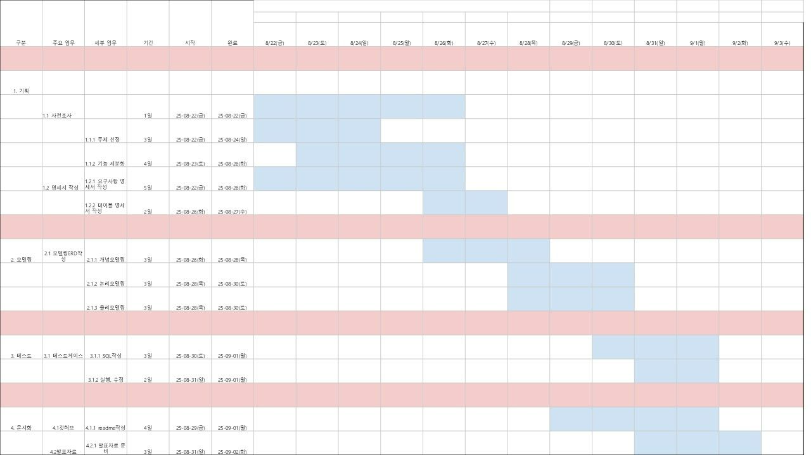
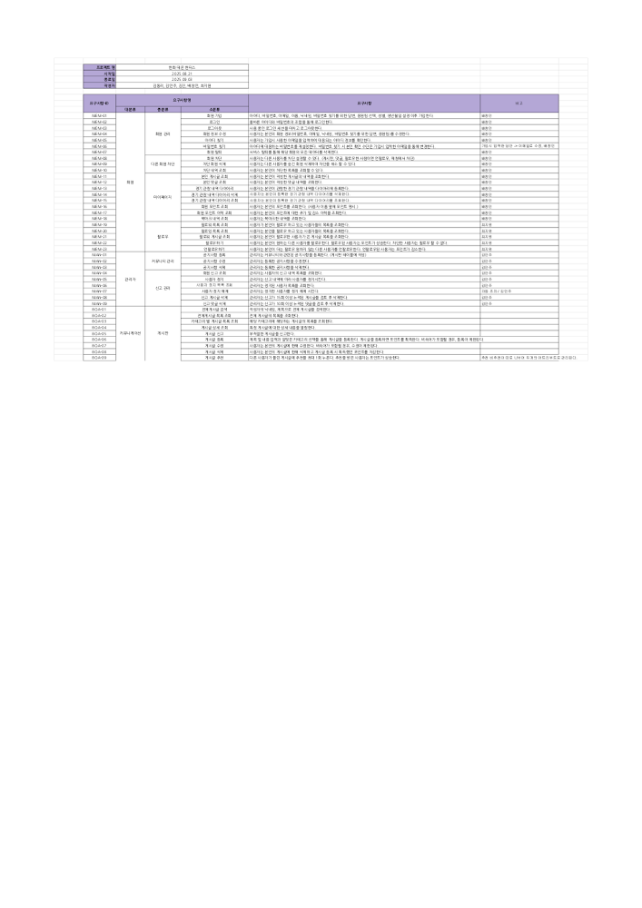
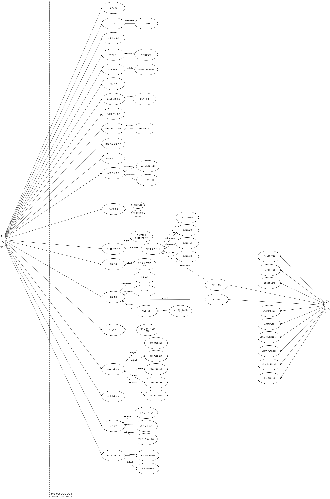
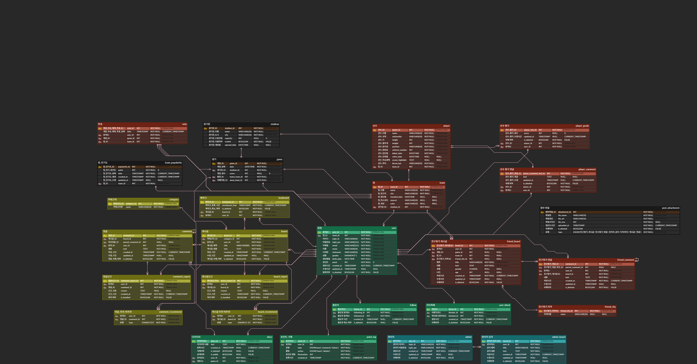

# ⚾Dugout
Dugout은 한국 프로야구 팬들을 위한 참여형 커뮤니티 플랫폼으로, 팬들이 소통하고 다양한 콘텐츠를 즐길 수 있는 공간을 제공합니다.

## 👥 1. 팀원소개 
[김동리](https://www.notion.so/2582e9a3290281389afdeff8428fdc98?source=copy_link)   
[김민주](https://www.notion.so/2582e9a3290281fd930ff514479a324b?source=copy_link)   
[김진](https://www.notion.so/2582e9a3290281498debd7b6434201f2?source=copy_link)   
[배창민](https://www.notion.so/2582e9a3290281e8a52ae75fd10a5845?source=copy_link)   
[최지원](https://www.notion.so/2582e9a32902817dafe5c9370e79344f?source=copy_link)

## 📖 2. 프로젝트 개요
### 소개
Dugout은 한국 프로야구 팬들을 위한 참여형 커뮤니티 플랫폼을 목표로 합니다.
이곳에서는 팬들이 원하는 소통과 참여형 콘텐츠를 한 공간에서 손쉽게 경험할 수 있으며, 이를 통해 장기적인 팬덤 강화와 프로야구 산업의 지속적인 확장을 도모합니다.

### ⭐ Dugout의 특징 및 장점
- **통합 팬덤 공간**: 구단별로 분산된 팬 커뮤니티를 하나의 사이트 내에서 운영하여 팬 교류 강화(회원간 팔로우 기능,직관 친구 매칭, 구단별 통합 소통 창구, 구단별 투표 기능, 직접 만드는 선수 평가).
- **데이터 기반 확장성**: 이용자 데이터를 기반으로 맞춤형 콘텐츠·이벤트 제공 가능 → 마케팅 활용도 증가.

### 🛠 주요 기능
- **구단 통합 커뮤니티**
    - 전 구단 통합 게시판, 팬 모임 등 제공으로 다양한 커뮤니티 기능을 통해 팬들 간 활발한 소통 지원하여 팬 간 교류 활성화 및 소속감 강화
    - 직접 선수 평가 및 댓글을 통해 팬들이 만드는 선수 평가시스템 제공
- **회원 포인트 시스템**
    - 활동량, 팬 참여도에 따라 포인트를을 부여하여 커뮤니티 해당 이용자의 정보 신뢰성 제공
    - 포인트 누적을 유도하여 커뮤니티 활성화
- **직관 친구 찾기 및 추천 기능**
    - 사용자의 관심 구단, 선호 선수, 위치, 나이 등을 기반으로 맞춤형 직관 친구 찾기 및 추천 기능 제공
- **구단별 인기도 측정 및 투표**
    - 사용자가 설정한 팀을 통해 구단의 인기척도 확인
    - 경기 결과 예측을 통해 참여기능 확대

## 🥎 3. 유사 서비스
| 플랫폼 | 주요 기능 요약 | 강점 | 단점 |
| --- | --- | --- | --- |
| **구단 공식 홈페이지/앱** | 공식 정보 제공 (뉴스·영상·일정 등) | 신뢰성 높음, 독점 콘텐츠 제공 | 커뮤니티 기능 약함 |
| **네이버 야구** | 위젯, 실시간 알림, 오픈톡 채팅, 경기 데이터 제공 | 실시간 정보·소통, 편리한 접근성 | 실시간 영상 제공 제한 |
| **네이버 카페** | 팀별 커뮤니티 운영, 정보 공유, 팬 소통 | 특정 팀 자료/팬 활동 중심, 정보 깊음 | 활성도 차이, 공식성 낮음 |
| **엠엘비파크** | 야구 전문 커뮤니티, 분석·통계·중계 링크 제공 | 전문적 분석, 광범위 정보, 팬 토론 활발 | UI 복잡, 진입장벽, 활동 방식 부담감 가능 |
| **디시인사이드 야구갤러리** | 자유로운 소통 구조 | 실시간성, 사용자 맞춤 기능, 활성화 수준 | 정보 신뢰도 낮음, 유해 콘텐츠 위험 있음 |

## 💻 4. 개발 환경 및 기술 스택

📌 개발 환경
* DBMS   

* DB 관리 도구   

* 가상화 환경   

📌 협업 및 관리 도구

* 협업 도구   

 

* 버전 및 이슈 관리   

* 데이터 관리   

📌 ERD 및 다이어그램 도구

* ERD 및 다이어그램 도구   
 

## 🧢 5. 프로젝트 산출물
### 1. WBS

  
WBS 이미지

  

### 2. 요구사항 명세서
* 프로젝트 요구사항 명세서는 [여기](https://docs.google.com/spreadsheets/d/1aKpTmSCLcmLd4_0NxP548aITIQ6JUWpFq3gpb4unjY8/edit?usp=sharing)에서 확인하실 수 있습니다.

  
요구사항 명세서 이미지

  

### 3. UML
* 프로젝트의 UML 다이어그램은 [여기](https://drive.google.com/file/d/14fIqEHI4_JvdVqzAxLwa63DNPvW2UQNR/view?usp=sharing)에서 확인하실 수 있습니다.

  
다이어그램 이미지

 

### 4. DB 모델링
* 프로젝트의 ERD 모델링은 [여기](https://www.erdcloud.com/d/9SefTR798Zuztg7uf)에서 확인하실 수 있습니다.

  
ERD 이미지

